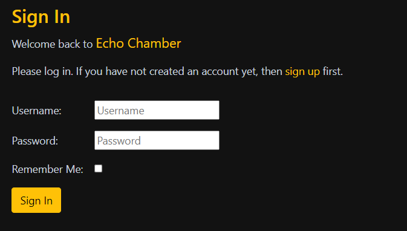

# Echo Chamber
Echo Chamber is a vibrant community-driven platform, where users can freely express their thoughts, share insightful posts, and engage in lively discussions. It's a place where text-based communication takes center stage, allowing members to delve deep into topics that matter to them.

 

Developer: [Logan Carlow](https://github.com/TerraBite147)  
[Live webpage](https://echo-chamber-ci-f4fdc2207726.herokuapp.com/) 
[Project Repository](https://github.com/TerraBite147/echo-chamber) 

# Table of Contents
1. [Project Goals](#project-goals)
2. [User Experience](#user-experience)
    - [Target Audience](#target-audience)
    - [User Requirements Expectations](#user-requirements-expectations)
    - [User Stories](#user-stories)
3. [Database Schema](#database-schema)
    - [Database Schema Overview](#database-schema-overview)
4. [Visual Design](#visual-design)
    - [Color Scheme](#color-scheme)
    - [Fonts](#fonts)
    - [Layout](#layout)
    - [Before users log in](#before-users-log-in)   

# Project Goals

### User Goals:
- Share Ideas: Users want to share their thoughts, opinions, and ideas with like-minded individuals.
- Discover Content: Users aim to discover new and interesting content posted by others within the community.
- Engage with Community: Users seek opportunities to engage with other members through comments, likes, and discussions.
- Build Relationships: Users may want to connect with others who share similar interests or viewpoints.
- Stay Informed: Users want to stay informed about trending topics, discussions, and community events.
### Site Owner Goals:
- User Engagement: The site owner aims to foster a vibrant and active community where users engage with each other's content regularly.
- User Retention: The site owner wants to encourage users to return to the platform frequently by providing valuable content and a positive user experience.
- Community Growth: The site owner seeks to attract new users and grow the community over time by promoting the platform and expanding its reach.
- Feedback Collection: The site owner aims to collect feedback from users to understand their needs, preferences, and suggestions for improving the platform.

# User Experience

### Target Audience:
- Community Enthusiasts: Individuals who are passionate about participating in online communities, sharing ideas, and engaging in discussions.
- Knowledge Seekers: Users who are curious and eager to explore diverse perspectives, learn new things, and expand their knowledge.
- Opinion Leaders: People who enjoy expressing their opinions, insights, and viewpoints on various topics and influencing others in the community.
- Social Networkers: Individuals who value social connections and enjoy interacting with like-minded individuals who share their interests and values.
- Content Creators: Users who produce original content, such as articles, blog posts, and seek a platform to showcase their creations to a receptive audience.
### User Requirements Expectations:
- Intuitive User Interface: Users expect a clean, user-friendly interface that is easy to navigate, allowing them to browse content, interact with others, and access features effortlessly.
- Content Discovery: Users require robust content discovery features, categories, tags, to help them find relevant and interesting content quickly.
- Engagement Tools: Users expect features for engagement, such as commenting and liking, to facilitate interaction and community building.
- Responsive Design: Users access the platform from various devices, so they expect a responsive design that adapts seamlessly to different screen sizes and resolutions for a consistent experience.
- Community Guidelines: Users value clear community guidelines and moderation policies to ensure a safe, respectful, and inclusive environment conducive to open dialogue and constructive discourse.
- Feedback Mechanism: Users appreciate the ability to provide feedback, report issues, and suggest improvements to help shape the platform and enhance their experience over time.

By understanding the target audience and their requirements and expectations, the Echo Chamber platform can be designed and developed to meet their needs effectively, fostering a positive and engaging user experience.

## User Stories
User stories and tasks were put into Three 'epics' to establish a well-defined work structure. You can access the details of these milestones by clicking [here](https://github.com/TerraBite147/echo-chamber/milestones), which will take you to the milestone overview.

### Epic 1: User Authentication
This epic focuses on user account management, including registration, login/logout.

- [User Story: Account Creation (MUST HAVE)](https://github.com/TerraBite147/echo-chamber/issues/2)
- [Login from Landing Page (MUST HAVE)](https://github.com/TerraBite147/echo-chamber/issues/16)
- [Password Reset (WON'T HAVE)](https://github.com/TerraBite147/echo-chamber/issues/17)
- [Profile Page (SHOULD HAVE)](https://github.com/TerraBite147/echo-chamber/issues/15)

### Epic 2: Post Interaction
This epic focuses on the interaction between users and posts, including creating, editing, and deleting posts as well as liking and commenting on posts.

- [User Story: View list of Posts (MUST HAVE)](https://github.com/TerraBite147/echo-chamber/issues/12)
- [User Story: View Post Details (MUST HAVE)](https://github.com/TerraBite147/echo-chamber/issues/14)
- [User Story: Create Post (MUST HAVE)](https://github.com/TerraBite147/echo-chamber/issues/3)
- [User Story: Edit Post (MUST HAVE)](https://github.com/TerraBite147/echo-chamber/issues/18)
- [User Story: Delete Post (SHOULD HAVE)](https://github.com/TerraBite147/echo-chamber/issues/7)
- [User Story: Like Post (SHOULD HAVE)](https://github.com/TerraBite147/echo-chamber/issues/5)
- [User Story: Comment on Post (MUST HAVE)](https://github.com/TerraBite147/echo-chamber/issues/4)
- [User Story: Edit Comment (COULD HAVE)](https://github.com/TerraBite147/echo-chamber/issues/8)
- [User Story: Delete Comment (COULD HAVE)](https://github.com/TerraBite147/echo-chamber/issues/19)
- [User Story: Like Comment (COULD HAVE)](https://github.com/TerraBite147/echo-chamber/issues/20)
- [User Story: User Story: Infinite Scrolling for Posts (SHOULD HAVE)](https://github.com/TerraBite147/echo-chamber/issues/13)

### Epic 3: Admin Panel
This epic focuses on the admin panel, including user management, post management, and comment management.

- [User Story: Admin Panel (MUST HAVE)](https://github.com/TerraBite147/echo-chamber/issues/21)
- [User Story: User Management (MUST HAVE)](https://github.com/TerraBite147/echo-chamber/issues/22)
- [User Story: Post Management (MUST HAVE)](https://github.com/TerraBite147/echo-chamber/issues/23)
- [User Story: Comment Management (MUST HAVE)](https://github.com/TerraBite147/echo-chamber/issues/24)

## Database Schema

When creating the database schema, I used dbdiagram.io to create a visual representation of the database schema. You can view the database schema below.

## Database Schema Overview

This section provides an overview of the database schema used in the application, detailing the tables and their relationships.

### Tables

#### User
- **id**: Primary Key, Integer
- **username**: String
- **email**: String
- Additional fields as defined by Django's built-in User model.

#### Category
- **id**: Primary Key, Integer
- **name**: String, Unique
- **description**: Text

#### Post
- **id**: Primary Key, Integer
- **title**: String
- **slug**: String, Unique
- **author_id**: Foreign Key to User
- **content**: Text
- **posted_at**: DateTime
- **category_id**: Foreign Key to Category (nullable)
- **status**: Integer (0 for Draft, 1 for Published)
- **excerpt**: Text
- **updated_on**: DateTime

#### PostLike
- **id**: Primary Key, Integer
- **post_id**: Foreign Key to Post
- **user_id**: Foreign Key to User
- **created_at**: DateTime
- Unique constraint on (`post_id`, `user_id`)

#### Comment
- **id**: Primary Key, Integer
- **post_id**: Foreign Key to Post
- **author_id**: Foreign Key to User
- **content**: Text
- **created_at**: DateTime

#### CommentLike
- **id**: Primary Key, Integer
- **comment_id**: Foreign Key to Comment
- **user_id**: Foreign Key to User
- **created_at**: DateTime
- Unique constraint on (`comment_id`, `user_id`)

#### Notification
- **id**: Primary Key, Integer
- **user_id**: Foreign Key to User
- **message**: String
- **is_read**: Boolean
- **created_at**: DateTime
- **target_url**: String, Nullable

### Relationships

- A `Post` is associated with one `User` (author) and optionally one `Category`.
- A `PostLike` associates a `User` with a `Post` they like.
- A `Comment` is associated with one `User` (author) and one `Post`.
- A `CommentLike` associates a `User` with a `Comment` they like.
- A `Notification` is associated with one `User`.

This schema effectively organizes the data for Echo Chamber, ensuring robust data management and efficient data retrieval for various features like posts, comments, likes, and notifications.

## Visual Design

The Visual Design section provides an overview of the design elements used in the application, including color scheme, typography, and layout.

### Color Scheme

The colour scheme for Echo Chamber is sleek and modern, with a combination of dark and light shades to create a visually appealing interface. The primary colors used in the design are as 

### Fonts

The typography for Echo Chamber is clean and easy to read, with a focus on readability and legibility. The primary fonts used in the design are Roboto and Lato, which are widely used for web design due to their versatility and readability.

### Layout

The layout of Echo Chamber is designed to be user-friendly and intuitive, with a clean and organized structure that guides users through the platform seamlessly. The design features a responsive layout that adapts to different screen sizes and resolutions, ensuring a consistent user experience across devices.

### **Before users log in**
They are greeted with a landing page that takes them straight to a list of posts. Once logged in, users can access their profile page, create new posts, view post details, like posts, comment on posts, and interact with other users through the platform's features.

- **Header**: The header features the site logo, navigation menu, and login and registration links.

- **Landing Page**: The landing page features a list of posts, allowing users to browse and discover content easily with options to filter by category and sort by date or popularity.

- **About Page**: The about page provides information about the platform, and community guidelines, fostering a positive and inclusive environment for users.

- **Login Page**: The login page allows users to log in to their account securely, providing a smooth and hassle-free login experience.

- **Sign up Page**: The Sign Up page enables new users to create an account quickly and easily, with fields for username, email, and password.

- **Post Details Page**: The post details page displays the full content of a post, along with comments, likes, liking or commenting will redirect the user to the log in page.

### **After users log in**
They can access additional features such as creating new posts, liking posts, commenting on posts, and viewing notifications. Users can also access their profile page to view their posts, comments, draft posts, and notifications.

- **header**: The header displays the site logo, navigation menu, user profile button, and notification icon when a new notification is available.

- **Profile Page**: The profile page showcases the user's posts, comments, draft posts and notifications. Users can expand the dropdowns to view details on the post, comments and edit draft posts.

- **Create Post Page**: The create post page allows users to compose new posts with a title, content, category, and excerpt, providing a seamless post creation experience. 

- **Edit Post Page**: The edit post page enables users to edit their existing posts, with fields for title, content, category, and excerpt, allowing users to update their posts easily.

-  **Post Details Page**: The post details page displays the full content of a post, along with comments, likes, and options to like or comment on the post and options to edit or delete the post if the user is the author.

- **Sign out**: The sign-out button allows users to log out of their account securely, ensuring data privacy and account security.

By providing a seamless user experience with intuitive navigation, clear visual hierarchy, and engaging design elements, Echo Chamber aims to create a vibrant and interactive platform where users can freely express their thoughts, share ideas, and engage with the community effectively.

## Technologies Used

### Languages
- HTML5
- CSS3
- JavaScript
- Python

### Frameworks and Libraries
- Django
- Bootstrap
- Crispy Forms

### Database
- PostgreSQL

### Tools and Platforms
- Git
- GitHub
- Gitpod
- Heroku
- dbdiagram.io
- fontawesome
- Google Fonts
- ChatGPT

