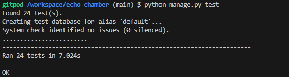

# Echo Chamber Testing

 

Developer: [Logan Carlow](https://github.com/TerraBite147)  
[Live webpage](https://echo-chamber-ci-f4fdc2207726.herokuapp.com/) 
[Project Repository](https://github.com/TerraBite147/echo-chamber) 

## Table of Contents

## Code Validation

- HTML: Click link to see test results [W3C Validator](https://validator.w3.org/nu/?doc=https%3A%2F%2Fecho-chamber-ci-f4fdc2207726.herokuapp.com%2F)
- CSS: Click link to see test results [W3C Validator](https://jigsaw.w3.org/css-validator/validator?uri=https%3A%2F%2Fecho-chamber-ci-f4fdc2207726.herokuapp.com%2F&profile=css3svg&usermedium=all&warning=1&vextwarning=&lang=en)
- JavaScript: [JSHint](https://jshint.com/)
    - comment-like.js no errors warnings for usings $ for jQuery ignored
    - infinite-scroll.js no errors warnings for usings $ for jQuery ignored
    - post-like.js no errors warnings for usings $ for jQuery ignored
- Python: [CI Python Linter](https://pep8ci.herokuapp.com/)
    - forms.py no errors
    - models.py no errors
    - urls.py no errors
    - views.py no errors
    - test_views.py no errors

## Performance Testing

I conducted performance testing using google chrome light house. The results are as follows:

- index.html, _post_list.html , _post_list_partial.html, 
    - Performance: 99
    - Accessibility: 90
    - Best Practices: 100
    - SEO: 100

- about.html
    - Performance: 100
    - Accessibility: 90
    - Best Practices: 100
    - SEO: 100

- _profile.html
    - Performance: 100
    - Accessibility: 90
    - Best Practices: 100
    - SEO: 100

- _post_edit.html
    - Performance: 100
    - Accessibility: 91
    - Best Practices: 100
    - SEO: 100

- _post_detail.html , _post_interactions.html, comment_interactions.html
    - Performance: 100
    - Accessibility: 86
    - Best Practices: 100
    - SEO: 89

## Device compatibility

I tested the website on the following devices:

- Various Desktops
- Various Laptop
- iPhone 8
- Samsung Galaxy S20

The website was responsive on all devices and the functionality was consistent across all devices.

## Browser compatibility

I tested the website on the following browsers:

- Google Chrome
- Microsoft Edge
- Mozilla Firefox
- Safari

The website was responsive on all browsers and the functionality was consistent across all browsers.

## Automated Testing

I used Django's built-in testing framework to test the functionality of the website. The tests can be found in the tests.py file in the main app directory. The tests cover the following:

- Testing the views models and urls

## Manual Testing

I conducted manual testing on the website to ensure that all functionality was working as expected. 

| Test Case | Description | Method | Expected Outcome | Actual Outcome | Pass/Fail |
| --- | --- | --- | --- | --- | --- |
| Register | Register a new user | Click on register and fill in the form | User is registered, logged in and redirected to the home page | User is registered, logged in and redirected to the home page | Pass |
| Login | Login as an existing user | Click on login and fill in the form | User is logged in and redirected to the home page | User is logged in and redirected to the home page | Pass |
| Create Post | Create a new post | Click on create post and fill in the form | Post is created and displayed on the home page | Post is created and displayed on the home page | Pass |
| Edit Post | Edit an existing post | Click on edit post and change the content | Post is updated and displayed on the home page | Post is updated and displayed on the home page | Pass |
| Delete Post | Delete an existing post | Click on delete post | Post is deleted and no longer displayed on the home page | Post is deleted and no longer displayed on the home page | Pass |
| Like Post | Like an existing post | Click on like post | Post is liked and like count is updated | Post is liked and like count is updated | Pass |
| Unlike Post | Unlike an existing post | Click on unlike post | Post is unliked and like count is updated | Post is unliked and like count is updated | Pass |
| Comment on Post | Comment on an existing post | Click on comment and fill in the form | Comment is added and displayed on the post | Comment is added and displayed on the post | Pass |
| Delete Comment | Delete an existing comment | Click on delete comment | Comment is deleted and no longer displayed on the post | Comment is deleted and no longer displayed on the post | Pass |
| Like Comment | Like an existing comment | Click on like comment | Comment is liked and like count is updated | Comment is liked and like count is updated | Pass |
| Unlike Comment | Unlike an existing comment | Click on unlike comment | Comment is unliked and like count is updated | Comment is unliked and like count is updated | Pass |
| Profile | View user profile | Click on profile | User profile is displayed with posts , comments, notifications and drafts are shown | User profile is displayed with posts , comments, notifications and drafts are shown | Pass |
| Open Post | View post details | Click on post title | Post details are displayed with comments and interactions | Post details are displayed with comments and interactions | Pass |
| Scroll | Infinite scroll | Scroll to the bottom of the page | More posts are loaded | More posts are loaded | Pass |
| Sort | Sort posts | Click on sort by dropdown | Posts are sorted by date, likes or comments | Posts are sorted by date, likes or comments | Pass |
|Filter | Filter posts | Click on filter by dropdown | Posts are filtered by Category | Posts are filtered by Category | Pass |
| Logout | Logout of account | Click on logout | User is logged out and redirected to the home page | User is logged out and redirected to the home page | Pass |
| Notifications | View notifications | Click on notifications | Notifications are displayed | Notifications are displayed | Pass |
| Drafts | View drafts | Click on drafts | Drafts are displayed | Drafts are displayed | Pass |
| Draft edit | Edit draft | Click on edit draft | Draft is edited and saved | Draft is edited and saved | Pass |
|

Summary of manual testing:

- All functionality is working as expected
- The website is responsive on all devices and browsers
- The website is user-friendly and easy to navigate
- The website is visually appealing and consistent across all pages
- The website is accessible.

## Conclusion

The website has been thoroughly tested and all functionality is working as expected. The website is responsive, user-friendly, visually appealing and accessible. The website is compatible with all devices and browsers. The website has been validated and performance tested. The website has been automated and manually tested. The website is ready for deployment.

## Important Note to the Assessor

I manually created a few posts but everything below this post.

Everything below this (When sorting by date) is generated by Faker and cannot be opened.
The other posts are there for the purpose of testing the infinite scroll feature.